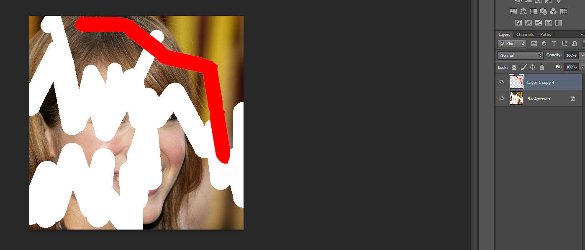
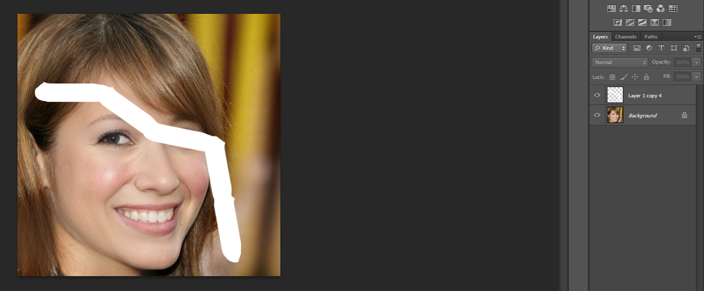
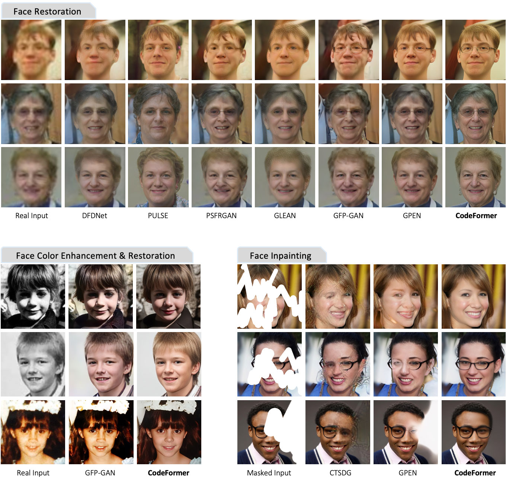
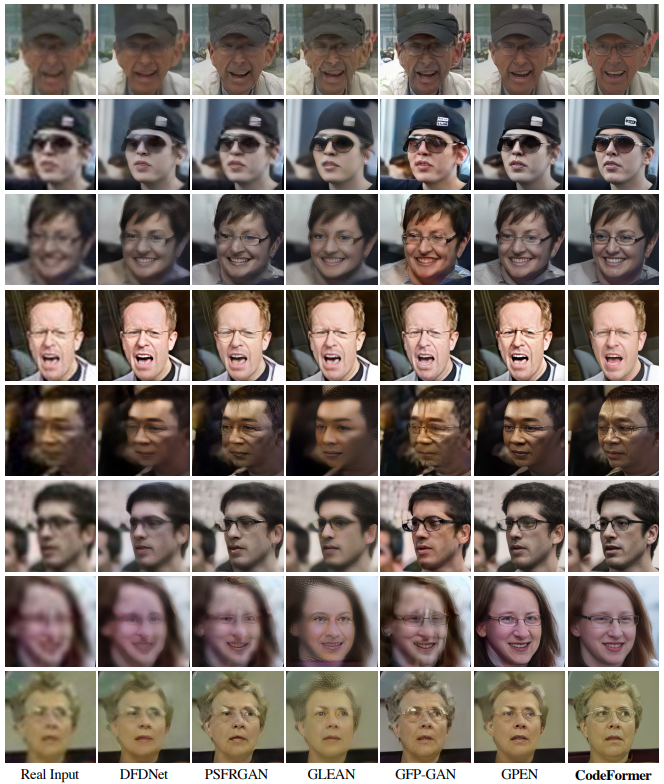
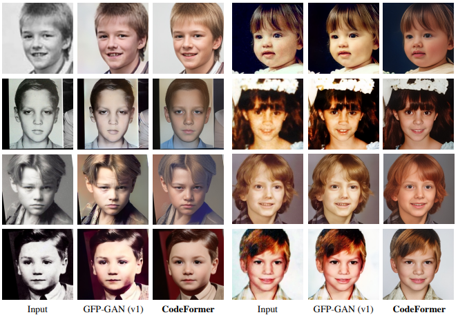
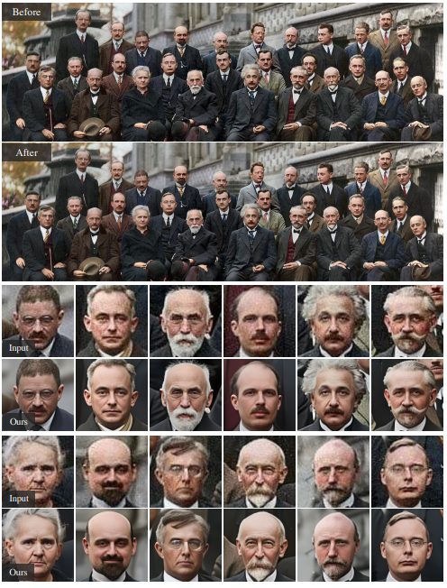
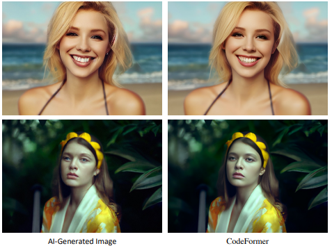
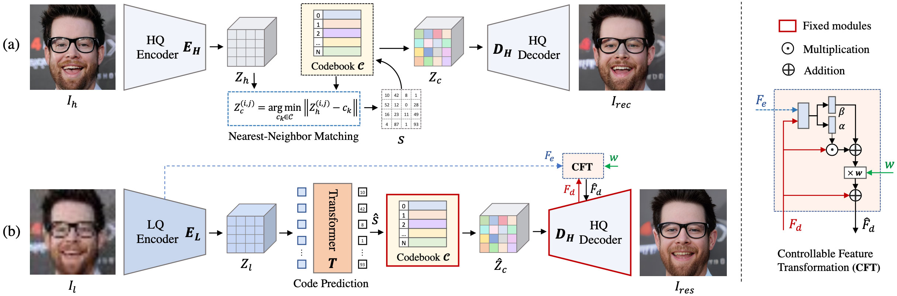

# Implement AI for Photo Restoration to Google Colaboratory.

### [AI to use](https://github.com/sczhou/CodeFormer)
#### Citation:
*inproceedings:* **zhou2022codeformer**  
    *authors:* **Zhou, Shangchen and Chan, Kelvin C.K. and Li, Chongyi and Loy, Chen Change**  
    *title:* **Towards Robust Blind Face Restoration with Codebook Lookup TransFormer**  
    *booktitle:* **NeurIPS**  
    *year:* **2022**  

### TO DO:
+ setup functional environment in *.ipynb --> good to use *Google Colaboratory* ✅
+ install requirements ✅
+ test if program is working ✅
+ make detail commented steps and documentation ✅
+ make easy to use user interface for using AI ✅
+ try to train model ? --> new colab (to not break working proof)

 

### TESTED + results:
+ Whole Image Restoration - good working ✅
+ Face Restoration - good working ✅
+ Face Colorization - so, so working ✅
+ Face Inpainting - not working ❌ - scamed?
+ AI face repair - good working ✅
+ Video Enhancement - ✅

 

### DEAD LINE 11.12.23

## [ *GC* version v1.2.1](https://drive.google.com/file/d/1YqDCJ2802Gi_7sm2TykyJ0Q8EE_sE2Ym/view?usp=sharing)

### Proof of not working Face Inpainting:

Copied whitespace and created new white line:

On the original image. Added copied whitespace:

Not working -> final "repaired" image dont fill these white lines, it fill just the original ones. It can be caused by used Photoshop version.

### Comparison

All in One Comparison of existing Photo Restoration AIs (from documentation):  

 

LQ - HQ Comparison:  

 

Colorization:  

 

Finall full old Photo: 

 

AI fix face: 

 

### Used algorithm 

Used Algorith -> from documentation:  

 

### Points:
#### LQ - HQ
- vector quantization --> quantized autoencoder --> create a codebook and coresponding decoder
- for face restoration we use priority of combination from codebook with decoder
- *face is stored as compressed and every pixel is replaced with nearest pixel from trained codebook*
- Decoder (Dh) then reconstructs face to High Quality image defined with sequence of choosen pixels
- coder (Eh) and decoder (Dh) consist of 12 blocks and 5 resize layers -> this give us a large compession ratio, which leads to great robustness against defradation
- N (number of items in codebook) is set to 1024, which is best before model starts degrading.
- Very Low quality textures leads to failure of finding neares neighbour pixel -> so we use `Transformer` to model a global better code prediction.
- used training dataset is FFHQ dataset (70,000 High quality images) -> we degradate their quality and pair them.
- testing datasets : `LFW-Test`(low degradated (1,711) imgs), `WebPhoto-Test`(medium degradated (407) imgs) and `WIDER-Test` (heavy degradated (970) imgs)
- Settings: `512x512x3` face images, optimizer `Adam`, iterations: Stage I = `1,5M` Stage II = `200K` and Stage III = `20K`, used Pytorch framework using *NVIDIA Tesla V100 GPU*.
#### Colorization
- random color jitter and grayscale conversion used as in GFP-GAN (v1) AI 

#### Limitation
- less effective to restore side faces (bcs datasets contain less this kinds of images)
